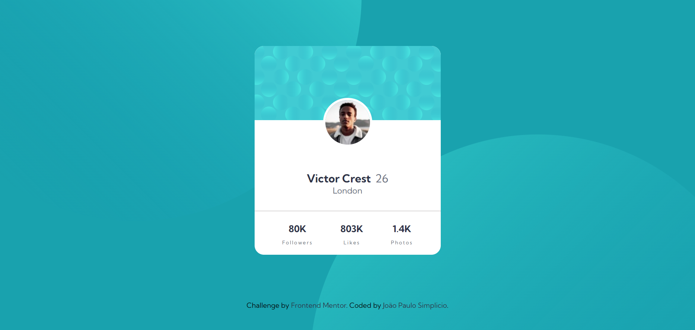

# Frontend Mentor - Profile card component solution

This is a solution to the [Profile card component challenge on Frontend Mentor](https://www.frontendmentor.io/challenges/profile-card-component-cfArpWshJ). Frontend Mentor challenges help you improve your coding skills by building realistic projects. 

## Table of contents

- [Overview](#overview)
  - [The challenge](#the-challenge)
  - [Screenshot](#screenshot)
  - [Links](#links)
- [My process](#my-process)
  - [Built with](#built-with)
  - [Continued development](#continued-development)
- [Author](#author)

## Overview

### The challenge

Reproduction of provided designs.

### Screenshot

### Links

- [Solution URL](https://github.com/simplicioJoao/frontend-mentor-profile-card-component)
- [Live Site URL](https://simpliciojoao.github.io/frontend-mentor-profile-card-component/)

## My process

### Built with

- Semantic HTML5 markup
- CSS custom properties
- CSS Flexbox

### Continued development

In this challenge I was able to apply basic concepts of responsiveness. Now I intend to learn about media queries in order to improve visualization on various types of screens.

## Author

- Frontend Mentor - [@simplicioJoao](https://www.frontendmentor.io/profile/simplicioJoao)
- GitHub - [@simplicioJoao](https://github.com/simplicioJoao)
- LinkedIn - [João Paulo Simplicio](https://www.linkedin.com/in/joão-paulo-simplicio-612bb025a)
